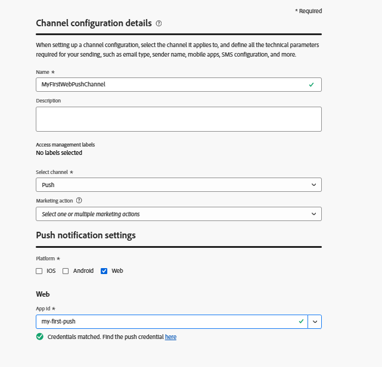

# 创建推送渠道

第一步是在Adobe Journey Optimizer中创建推送渠道。 在此设置过程中，您需要生成VAPID密钥，验证和启用Web推送通知需要这些密钥。 然后，这些密钥将在推送渠道配置中使用，从而允许AJO安全地向订阅的用户发送通知。

## 生成VAPID密钥

VAPID（自愿应用程序服务器识别）是一种Web推送标准，允许您的服务器识别自己的身份以推送服务（如Chrome、Edge等） 使用公钥/私钥对，以便推送提供商知道谁在发送通知。

它使用web-push generate-vapid-keys之类的工具生成，该工具会创建公共密钥（与浏览器共享）和私钥（保存在服务器上），共同用于验证和安全发送推送消息。

在本教程中，我们已使用Node.js生成VAPID密钥。

确保已安装Node.js。 然后发出以下命令

`npm install web-push -g `

`web-push generate-vapid-keys`

## 创建推送凭据

* 登录Journey Optimizer

* 导航到管理 |渠道 |推送设置 |推送凭据|创建推送凭据

* 

## 创建渠道配置

* 登录Journey Optimizer

* 导航到管理 |渠道 |创建渠道配置
  
