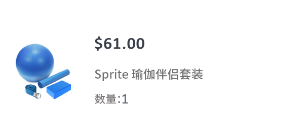
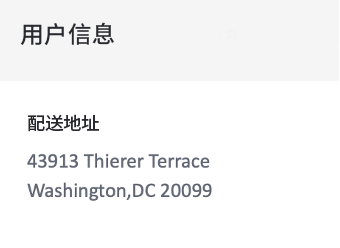

# 创建订单确认事务型电子邮件


| 挑战 | 创建订单确认事务型电子邮件 |
|---|---|
| 角色 | 历程管理器 |
| 所需技能 | <ul><li>[使用消息编辑器创建电子邮件内容](https://experienceleague.adobe.com/docs/journey-optimizer-learn/tutorials/create-messages/create-email-content-with-the-message-editor.html?lang=en)</li> <li>[使用上下文事件信息进行个性化](https://experienceleague.adobe.com/docs/journey-optimizer-learn/tutorials/personalize-content/use-contextual-event-information-for-personalization.html?lang=en)</li><li>[使用辅助函数进行个性化](https://experienceleague.adobe.com/docs/journey-optimizer-learn/tutorials/personalize-content/use-helper-functions-for-personalization.html?lang=en)</li></ul> |
| 要下载的资产 | [订单确认资产](/help/challenges/assets/email-assets/order-confirmation-assets.zip) |

## 故事

Luma正在推出其在线商店，并希望在客户下订单后通过提供订单确认电子邮件来确保客户获得良好的体验。

创建和个性化事务性订单确认消息。

## 有你需要的吗？

## 您的挑战

创建在Luma客户完成在线订单时触发的订单确认电子邮件。

### 创建订单确认电子邮件

创建一封标题为“（您的名称）_Luma — 订单确认”的新电子邮件。 主题行必须使用收件人的名字进行个性化，并且必须包含“感谢您的购买”短语

遵循Luma品牌准则，电子邮件的结构应如下所示：

<table>
<tr>
<td>
  <div>
     <strong> 标题部分</strong>
      </div>
  </td>
  <td>
    <strong>Luma徽标</strong>
      <p>
     <li>luma_logo.png</li>
    <li>大小35%，居中为白色背景 </li>
    <li>它应具有指向luma网站的链接：https://publish1034.adobedemo.com/content/luma/us/en.html</li>
    <p>
    提示：您将在assets文件夹中找到名为“消息图像”的所有图像。 <p>
    </td>
  </tr>
  <tr>
  <td>
  <div>
    <strong>订单确认部分
    </strong>
  </td>
  <td>
    <strong>图像</strong><p>
    <li>luma-transactional-order-confirmation-2.jpg </li>
    <li>边距：顶部，底部(10)<div>
    <p>
    <strong>文本</strong><p>
    <em>谢谢你的购买！</em><p>
    <li>对齐方式：left  </li>
   <li>文本颜色：rgb(101, 106, 119);font-size:14px</li>
    <li>内边距：左(95)、右(95)</li><div>
    <p>
     <em>已下订单。
    <p>包发货后，我们会向您发送一封包含跟踪号码的电子邮件，以便您跟踪订单。</p></em>
    </strong><p>
    <li>对齐方式：left  </li>
    <li>文本颜色：rgb(101, 106, 119);font-size:14px </li>
    <li>内边距：左(95)、右(95)</li><div>
    </a>
    <p>
    <strong>按钮:</strong>
   <p><em>查看订单</em></p>
      <li>背景颜色：rgb(25, 121, 195)</li>
      <li>文本颜色：白色</li>
      <li>无边框</li>
      <li>高度：40</li>
      <li>添加指向您选择的网站的链接 </li>
      <li>左对齐上方的文本(提示：使用容器边距)</li>
  </td>
 <tr>
<td>
  <div>
     <strong>订单详细信息部分</strong>
      </div>
      <p>提示:
      <li>这是上下文事件信息。 只有在将消息添加到历程后，您才能在上下文中添加（请参阅步骤2）。 在将电子邮件添加到历程并使用上下文事件信息对其进行修改之前，请勿发布该电子邮件！</li>
      <li>使用帮助程序函数：每个</li>
      <li>使用HTML编辑器格式化上下文数据。使用DIV标记将信息放入容器中。</li>
  </td>
  <td>
    <strong>头</strong>
    <p>
    <em>订单{采购订单编号}</em>
    </p>
    <strong>已订购的产品列表：
  </strong>
  <p>每个项目的格式应如下所示：
    
</p>
<strong>产品图像：</strong>
<li>类：购物车椅
<li>样式：边框：min-height:40px</li>
<li>上边距和下边距：20px</li>
<li>padding-left:80px</li>
<li>border-radius:0px</li>
<li>用作容器的背景图像</li>
<li>背景位置：0% 50%</li>
<li>背景大小：60px</li>
<li>background-repeat:无重复</li>
<p>
<strong>价格:</strong>
<li>格式= H5</li>
<li>style = box-sizing:border-box</li>
<li>margin-bottom:5px</li>
<li>margin-top:0px;</li>
<p>
<strong>名称和数量：</strong>
<li>class=text-small</li>
<li>style=box大小：边框</li>
<li>padding-top:5像素</li>
<li>颜色：rgb(101, 106, 119)</li>
<li>font-size:14px</li>
<p>
</td>
  </tr>
</table>

### 创建历程

1. 将历程命名为“您的姓名_Luma — 订单确认”
1. 使用事件：LumaOnlinePurchase
1. 操作：添加在步骤1中创建的消息
1. 返回到消息并添加上下文属性
1. 发布电子邮件

>[!TIP]
>
>为了让您对历程进行故障诊断，最佳做法是在超时或出错的情况下为所有消息操作添加替代路径。

+++成功标准

触发您在测试模式下创建的历程，并向您自己发送电子邮件：

1. 通过单击眼睛符号显示隐藏值：
   1. 在电子邮件参数中，单击T符号（启用参数覆盖）
      
   2. 单击Address字段
   3. 在下一个屏幕上，将您的电子邮件地址添加到括号中： *yourname@yourdomain* 在表达式编辑器中，单击确定。
2. 将历程置于测试模式
3. 使用以下参数触发事件：
   * 将配置文件标识符设置为：Jenna_Palmer9530@emailsim.io
   * 事件类型：commerce.purches
   * 名称：雪碧瑜伽伴侣套件
   * 数量：1
   * 总价：61
   * 订单编号：6253728
   * SKU:24-WG080
   * productImageURL: <https://publish1034.adobedemo.com/content/dam/luma/en/products/gear/fitness-equipment/luma-yoga-kit-2.jpg>

您应会收到包含指定产品的个性化购买确认电子邮件。

* 主题行应以测试用户档案的名字开头：珍娜
* 在测试时输入的订单详细信息应填充订单详细信息部分
* 客户信息应包含测试用户档案的城市和邮政编码：

   华盛顿特里尔泰勒斯43913 20099

+++

+++检查您的工作

**主题行：**

{{ profile.person.name.firstName }}，感谢您的购买！

**标题和确认部分：**


**更详细的章节：**


以下是您的代码所应显示的内容：

标头:

```javascript
Order: {{context.journey.events.1627840522.commerce.order.purchaseOrderNumber}}
```

产品列表：

使用帮助程序函数“each”创建产品列表。 以下是您的代码所应显示的内容：

```javascript
{{#each context.journey.events.1911672547.productListItems as|product|}}
<div class="cart-item-chair" style="box-sizing:border-box;min-height:40px;padding-top:20px;padding-bottom:20px;padding-left:80px;border-radius:0px;background-image:url({{product._wwfovlab065.productImageURL}});background-position:0% 50%;background-size:60px;background-repeat:no-repeat;">
<h5 style="box-sizing:border-box;margin-bottom:5px;font-size:16px;line-height:20px;margin-top:0px;">${{product.priceTotal}}.00</h5>
<div class="text-small" style="box-sizing:border-box;padding-top:5px;color:rgb(101, 106, 119);font-size:14px;">{{product.name}}</div><div class="text-small" style="box-sizing:border-box;padding-top:5px;color:rgb(101, 106, 119);font-size:14px;">Quantity: {{product.quantity}}</div></div><div class="divider-small" style="box-sizing:border-box;height:1px;margin-top:10px;margin-bottom:10px;background-color:rgb(209, 213, 223);"> </div>
{{/each}}

Total: ${{context.journey.events.1627840522.commerce.order.priceTotal}} 
```

**客户信息部分**



个性化应当如下所示：

```javascript
{{profile.homeAddress.street1}}
{{profile.homeAddress.city}},{{profile.homeAddress.state}} {{profile.homeAddress.postalCode}}
```

**页脚：**


**历程**


+++
