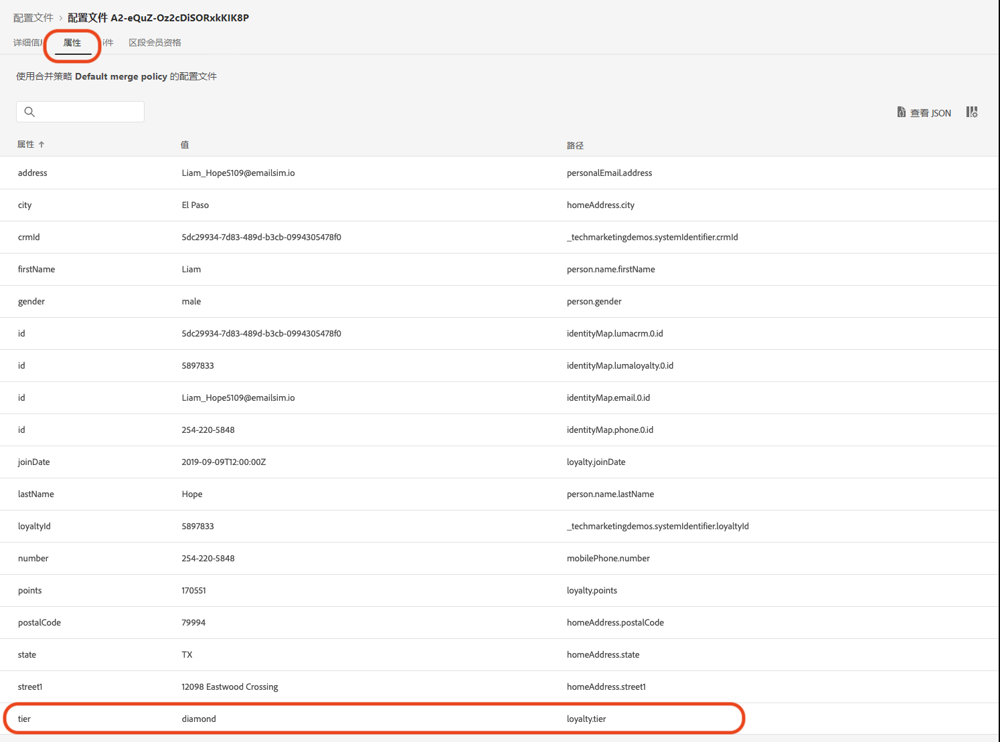
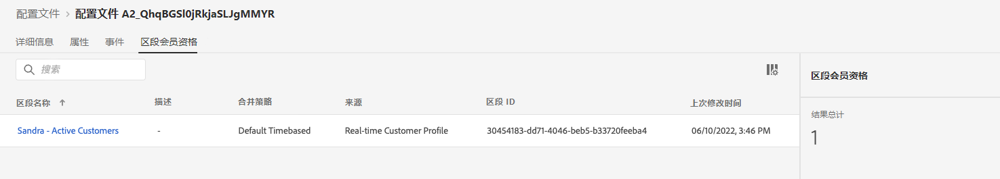

# 创建夏季系列发布公告 - 挑战


| 挑战 | 创建夏季系列发布公告 |
|---|---|
| 角色 | 历程管理者 |
| 所需技能 | <ul><li>[创建区段](https://experienceleague.adobe.com/docs/journey-optimizer-learn/tutorials/profiles-segments-subscriptions/create-segments.html?lang=zh-Hans)</li><li> [导入和编辑 HTML 电子邮件内容](https://experienceleague.adobe.com/docs/journey-optimizer-learn/tutorials/create-messages/create-emails/import-and-author-html-email-content.html?lang=zh-Hans)</li><li>[用例 - 读取区段](https://experienceleague.adobe.com/docs/journey-optimizer-learn/tutorials/create-journeys/use-case-read-segment.html?lang=zh-Hans)</li> |
| 可供下载的资源 | [季节系列电子邮件文件](/help/challenges/assets/email-assets/emails-seasonal-collection-announcement.zip) |

{style=&quot;table-layout:auto&quot;}

## 故事

一家虚构的运动服装公司 Luma 正在推广其最新的服装和装备系列，并提升来自现有客户的销售额。Luma 将推出新的夏季系列，并希望专门针对不同的客户群开展推广。

## 您的挑战

Luma 营销团队要求您在 Journey Optimizer 中实施一项夏季系列营销活动。您面临的挑战是：

* 创建一个区段，以确定哪些用户档案符合接收促销内容的条件。
* 构建历程。

### 步骤 1：定义区段 - 活跃客户

>[!BEGINTABS]

>[!TAB 任务]

#### 在 [!DNL Journey Optimizer] 中创建区段

* 在 [!DNL Journey Optimizer] 中创建一个名为&#x200B;*活跃客户*&#x200B;的区段。
* 该区段必须仅包含活跃的 Luma 客户。
* 活跃客户是指在 Luma 的品牌忠诚度计划中拥有等级（青铜、白银、黄金或铂金）的客户。


>[!TAB 成功标准]

在区段构建器中，您可以看到符合条件的用户档案的估计数量。如果您使用的是训练沙盒数据，则在 1290 个用户档案中有大约 753 个符合条件。

>[!NOTE]
>由于需要回填现有的用户档案，因此现有用户档案最多可能需要 24 小时才能显示区段会员资格。

**已向区段添加一个符合条件的用户档案：**

您可以通过导航到区段详细信息视图上所列的某个用户档案，来检查已添加到区段的用户档案是否符合条件。

在用户档案页面上，检查 [!UICONTROL Attributes] 选项卡，确认其是否符合条件：等级应该为白银、黄金、铂金或钻石。



您还可以检查 [!UICONTROL Segment membership] 选项卡：您的区段应会列出。



>[!TAB 检查您的工作]

区段字段：**[!UICONTROL Attributes]** > **[!UICONTROL XDM individual Profile]** > **[!UICONTROL Loyalty]** > **[!UICONTROL Tier]**

您的区段应如下所示：


代码应如下所示：

```javascript
stringCompare("equals", loyalty.tier, ["diamond", "gold", "platinum", "silver"], false)
```

>[!ENDTABS]


### 步骤 2：创建历程 - 夏季系列发布公告

>[!BEGINTABS]

>[!TAB 任务]

#### 发送夏季系列发布公告

一家机构为您提供了四个 HTML 文件，其中包含电子邮件的设计：

* `SeasonalCollectionEmail.html`
* Luma 男士系列电子邮件
* Luma 女士系列电子邮件
* Luma - 八折系列电子邮件

1. [下载季节系列的电子邮件文件](/help/challenges/assets/email-assets/emails-seasonal-collection-announcement.zip)。

1. 根据以下准则创建一个名为 *Luma - 夏季系列发布公告*&#x200B;的历程：

   1. 发送 *Luma - 全新夏季系列发布公告*&#x200B;电子邮件至&#x200B;*活跃客户*&#x200B;区段，保留 10% 的受众作为对照组
      * 消息标题为 *Luma - 夏季系列发布公告*
      * 主题行&#x200B;*（收件人的名字），全新 Luma 夏季系列现已上市！*
      * 使用提供的 HTML 文件 `SeasonalCollectionEmail.html` 作为电子邮件正文。
   1. 等到两天后，再发送一封包含更多针对性内容的跟进电子邮件消息：
      * 男性客户应收到 **Luma 男士系列**&#x200B;电子邮件。
         * 消息标题：*Luma 男士系列*
         * 主题行：*（收件人的名字），欢迎探索男士新运动装备！*
         * 电子邮件正文：将 `MensCollectionEmail.html` 用作电子邮件正文。
      * 女性客户应收到 **Luma 女士系列**&#x200B;电子邮件。
         * 消息标题：*Luma 女士系列*
         * 主题行：*（收件人的名字），欢迎探索 Luma 女士系列！*
         * 电子邮件正文：`WomensCollectionEmail.html`
      * 其他客户应收到 **Luma 八折系列**&#x200B;电子邮件。
      * 消息标题：*Luma 八折系列*
      * 主题行：*（收件人的名字），畅享八折优惠！*
      * 电子邮件正文：`20OOffCollectionEmail.html`
   1. 在发送上述有针对性的电子邮件后，等待两天时间，以等待客户打开电子邮件
   1. 如果有针对性的电子邮件未在 2 天内被客户打开，则发送 **Luma 八折系列电子邮件**&#x200B;作为最终的重定位尝试


>[!TAB 成功标准]

#### 预览电子邮件

**电子邮件消息 1：Luma - 夏季系列发布公告**

预览电子邮件：

1. 添加测试用户档案：Louise Petti：
   * 标识命名空间：*Luma CRM ID*
   * 标识值：*d1f132f9f9502bba047a6ec86c4b61f9*

结果：

* 主题行应为：Louise，全新 Luma 系列现已上市！
* 电子邮件正文应与您在预览中看到的内容匹配：[全新季节系列发布公告](/help/challenges/assets/email-assets/SeasonalCollectionEmail.html)

**电子邮件消息 2：Luma 男士系列**

向您自己发送验证：

1. 添加测试用户档案：Stanleigh Stooke：
   * 标识命名空间：*Luma CRM ID*
   * 标识值：`4f34057d9d9e792c28ba18ecae378e98`
1. 选择测试用户档案：Stanleigh Stooke。
1. 给您自己发送验证。

结果：\
您应当会收到一封电子邮件。主题行应该为 *Stanleigh，欢迎探索男士新运动装备！*&#x200B;且电子邮件正文应与您在预览中看到的内容相匹配：[Luma 男士系列](/help/challenges/assets/email-assets/MensCollectionEmail.html)

>[!NOTE]
>您可能需要几分钟才能收到验证。

**电子邮件消息 3：Luma 女士系列**

使用测试用户档案 *Louise Petti* 预览电子邮件。

* 主题行应为：*Louise，欢迎探索 Luma 女士系列！*
* 电子邮件正文应与您在预览中看到的内容匹配：[Luma 女士系列](/help/challenges/assets/email-assets/WomensCollectionEmail.html)

**电子邮件消息 4：Luma 八折系列**

使用测试用户档案 *Louise Petti* 预览电子邮件。

* 主题行应为：*Louise，畅享八折优惠！*
* 电子邮件正文应与您在预览中看到的内容匹配：[Luma 20% 折扣系列](/help/challenges/assets/email-assets/20OOffCollectionEmail.html)

#### 测试您的历程

>[!IMPORTANT]
>
>在将历程设置为测试模式之前：
>
>1. 确保[!UICONTROL 读取区段活动]具有设置为 **Luma CRM id(lumaCrmId)** 的命名空间
>1. 对于每封电子邮件，覆盖电子邮件的默认电子邮件参数，以便将其发送到您的电子邮件地址：
   >    * 通过单击眼睛符号显示隐藏值。
   >    * 在电子邮件参数中，单击 T 符号（启用参数覆盖）。

      >
      >      
   > 
   >    * 单击 [!UICONTROL Address] 字段
   >    * 在下一个屏幕中，在表达式编辑器中将您的电子邮件地址添加到括号中：`"yourname@yourdomain"`，然后单击 OK。

>


测试历程并将电子邮件发送到您自己的帐户：

1. 将历程置于测试模式。
1. 选择 **[!UICONTROL Single profile at a time]**。
1. 等待时间：将计时器设置为 120 秒（在字段中键入）。
1. 触发用户档案进入
1. 您可以使用以下任一 *Luma CRM Id* 作为用户档案标识符来测试每个分支：
   * 女：Leora Dietsche，标识值：`a8f14eab3b483c2b96171b575ecd90b1`
   * 男：Stanleigh Stooke，标识值： `4f34057d9d9e792c28ba18ecae378e98`
   * 未指定性别：Louise Petti，标识值：`d1f132f9f9502bba047a6ec86c4b61f9`

1. 触发用户档案进入后，您应会收到第一封电子邮件。应根据您选择的用户档案对标题进行个性化。
1. 历程应继续进入相应的分支，您应会收到相关电子邮件（例如，如果您选择 *Jenna*，您应会收到 *Luma 女士系列*&#x200B;电子邮件）。
1. 打开第二封电子邮件，历程应该结束。
1. 您可以为三个用户档案重复第 4 步至第 7 步操作以检查分支是否正常工作。
1. 要测试超时，请将等待时间设置为 30 秒，然后再次触发该条目。
1. 请勿打开您收到的电子邮件（请勿预览电子邮件 (!)） 让等待时间过去。

您应会收到以下电子邮件：

* Luma - 新季系列发布公告
* 根据您使用的测试用户档案，您应会收到以下电子邮件之一：
   * Leora：Luma 女士系列
   * Stanleigh：Luma 男士系列
   * Louise：Luma - 八折优惠系列
* 如果您未打开第二封电子邮件：Luma - 八折优惠系列

>[!TAB 检查您的工作]

您的历程应如下所示：


**条件 - 对照组：**


**条件 - 性别：**\


>[!ENDTABS]
