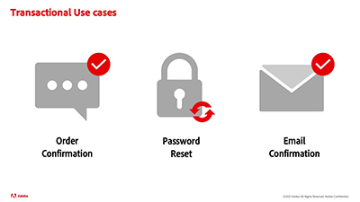

# Journey Optimizer 教程

Journey Optimizer 帮助企业为其客户提供贴合心意的、情境式和个性化的体验。客户历程是客户与品牌互动的整个过程，从接触的第一刻起直到客户离开。

本用户指南包含有关 Adobe Journey Optimizer 特性和功能的视频和教程。

## 新增功能

* **[使用条件规则生成器创建动态内容](/help/personalize-content/create-dynamic-content.md)**
  *了解如何创建和保存条件规则，以及如何将这些条件规则应用于所有渠道的内容。*

* **[使用警报](/help/administration/alerts.md)**
  *了解如何订阅针对意外历程行为的预定义警报，并通过电子邮件、Journey Optimizer 或使用 API 获得通知。*

* **[将历程复制到另一个沙盒](/help/create-journeys/copy-a-journey.md)**
  *了解如何将历程及其依赖对象从一个沙盒复制到另一个沙盒。*

* **[屏蔽消息中的数据](/help/privacy/mask-data-in-messages.md)**
  *了解数据屏蔽的含义以及为什么要屏蔽数据。 了解如何屏蔽 Journey Optimizer 消息中的数据。*

## Experience League 直播活动

* **[Adobe Journey Optimizer中的API触发消息传递](https://experienceleague.adobe.com/docs/events/experience-league-live-recordings/episodes/exl-live-episode-8-23-23.html?lang=zh-Hans)**
  *了解如何将REST API用于情境式、个性化和实时事务型通信及营销通信。*

* **[利用 Adobe Journey Optimizer 最大程度地发挥移动应用程序的潜力](https://experienceleague.adobe.com/docs/events/experience-league-live-recordings/episodes/exl-live-episode-5-24-23.html?lang=zh-Hans)**
  *了解将应用程序内消息传递作为实时互动渠道的优势，以及如何在 Adobe Journey Optimizer 中配置和创作个性化的移动应用程序体验。*

* **[通过 Web 渠道和内容实验探索 Adobe Journey Optimizer 的未来](https://experienceleague.adobe.com/docs/events/experience-league-live-recordings/episodes/exl-live-episode-6-14-23.html?lang=zh-Hans)**
  *新的 Web 渠道允许营销人员使用 WYSIWYG 可视化设计器构建 Web 营销活动。此外，Journey Optimizer 现在允许您试验任何渠道中的内容 - 电子邮件、Web、推送、应用程序内、短信等。*

* **[在 Adobe Journey Optimizer 中执行营销活动](https://experienceleague.adobe.com/docs/experience-league-live-events/events/episodes/exl-live-episode-09-22-22.html?lang=zh-Hans)**
  *在最初于 2022 年 9 月 22 日举行的 Experience League 直播节目中，主持人 Sandra Hausmann 与产品专家 Bridgete Darling 和 Frederic Mary 讨论了这一新功能涉及的用例，并演示了如何在 Journey Optimizer 中轻松设置和执行营销活动。*

* **[Adobe Journey Optimizer 的推送通知功能](https://experienceleague.adobe.com/docs/experience-league-live-events/events/episodes/exl-live-episode-05-12-22.html?lang=zh-Hans)**
  *在本期 Experience League Live 节目中，我们将讨论 Adobe Journey Optimizer 推送通知的常见用例，并深入探索有关如何为 Adobe Experience Platform 支持的推送功能配置应用程序的技术细节。*

## 员工精选

<table>
<tr>
  <td>
    
    

      <a href="./introduction/journey-optimizer-overview-part-1.md">
    <strong>Journey Optimizer 概述第 1 部分</strong>
    </a>
    

    

    <em>此视频演示了各家品牌可以如何使用 Adobe Journey Optimization 为其消费者提供个性化的全渠道历程。</em>
    

  </td>
    <td>
    
    

      <a href="./introduction/journey-optimizer-overview-part-2.md">
    <strong>Journey Optimizer 概述第 2 部分</strong>
    </a>
    

    

    <em>此视频演示了各家品牌可以如何使用 Adobe Journey Optimizer 的决策管理、实时区段鉴别和商业事件管理功能将其消费者历程的体验提升到新的高度。</em>
    

  </td>
  </td>
    <td>
    
    

      <a href="./decision-management/create-decisions.md">
    <strong>决策管理功能简介 </strong>
    </a>
    

    

    <em>该视频介绍了决策管理功能可解决的业务挑战、关键功能、基本架构和主要用例。

</em>
    

  </td>
</tr>
<tr>
  <td>
    
    

      <a href="./create-journeys/use-case-transactional-journey.md">
    <strong>用例 - 事务型历程 </strong>
    </a>
    

    

    <em>了解事务型历程的适用用例。了解如何构建事务型历程以及可以应用的最佳实践。</em>
    

  </td>
    <td>
    
    

      <a href="./personalize-content/use-contextual-event-information-for-personalization.md">
    <strong>使用上下文事件信息进行个性化 </strong>
    </a>
    

    

    <em>了解如何使用历程中的上下文事件信息来对消息进行个性化。</em>
    

  </td>
  </td>
    <td>
    
    

      <a href="./report-and-monitor/live-and-global-reports.md">
    <strong>实时和全局报表 </strong>
    </a>
    

    

    <em>了解实时报表和全局报表之间的差异，如何访问和分析历程和消息特定报表，以及如何修改报表仪表板。

</em>
    

  </td>
</tr>
</table>

