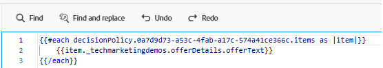

# 创建营销活动

为了向网页上的用户提供个性化优惠，在Adobe Journey Optimizer中创建了一个营销活动，并配置了正确的渠道（基于代码的体验渠道）。 此配置可确保通过实时决策将优惠提供给与网站交互的用户。

在此营销活动中，定义了一个决策策略来控制优惠的选择方式。 决策策略包括选择策略，该选择策略包括：

- 优惠项目的集合（例如，基于天气相关标记），
- 确定哪些选件适用于用户的资格规则，以及
- 一种排名公式，用于将分数分配给符合条件的优惠，以优先处理最相关的优惠。

当用户访问网站时，系统会检测其位置并使用天气API获取当前温度。 然后，此温度数据通过Web SDK (Alloy)发送到Adobe Experience Platform。 Adobe Journey Optimizer将根据此实时上下文数据评估为特定天气条件（如热、温和或冷）标记的预定义选件。 使用选择策略和排名公式的最相关选件使用Adobe的决策引擎自动呈现在网页上，确保用户接收与其所在地区的当前天气相一致的个性化内容。

## 在AJO中创建营销活动的高级步骤

- 创建渠道配置
   - 定义选件的显示位置及方式（例如，具有基于代码的体验的网页）。
   - 登录历程优化器
   - 导航到&#x200B;_&#x200B;**管理 — >渠道 — >创建渠道配置**&#x200B;_
   - **名称**： `offers-by-weather`\
     标识此配置以进行个性化Web优惠投放。
- **频道**：
  `Code-based experience`\
  选件不会直接插入到DOM中。 相反，AJO会返回使用自定义JavaScript解析的原始HTML。
- **平台**： `Web`\
  专门针对Web浏览器进行定位。 未启用任何移动渠道。

- **页面URL**： `https://gbedekar489.github.io/weather/weather-offers.html`\
  该渠道针对开发期间使用的特定测试页面进行配置。
- **在页面**&#x200B;上的位置： `offerContainer`\
  返回的选件会使用前端逻辑动态解析并呈现到此容器中。

- **内容格式**： `HTML`\
  选件作为原始HTML片段交付，允许完全控制其样式、过滤和显示方式。

- **开始新的营销活动**
   - 导航到营销活动部分，并创建新的计划营销活动。 正确命名营销活动。
   - **添加操作**
      - 添加基于代码的体验操作，并将该操作链接到之前创建的渠道配置。

   - **受众**
      - 所有访客（默认）。
      - 身份类型：ECID (Experience Cloud ID)
此设置使用ECID作为识别用户的主要标识。

- **创建决策策略**
   - 该操作已链接到&#x200B;**决策策略**，该策略定义如何选择优惠以及返回多少优惠以供显示。 此策略使用本教程前面创建的&#x200B;**选择策略**。
   - 要插入决策策略，请单击“操作”部分中的&#x200B;**_编辑内容_**，然后单击&#x200B;**_编辑代码_**&#x200B;以打开个性化编辑器。
   - 选择左侧的&#x200B;_&#x200B;**决策策略**&#x200B;_&#x200B;图标，然后单击&#x200B;**添加决策策略**&#x200B;按钮以打开&#x200B;**创建决策策略**&#x200B;屏幕。 为决策策略提供一个有意义的名称，并选择决策策略应返回的项目数。 默认值为1。
   - 单击&#x200B;**_下一步_**，然后将上一步中创建的选择策略添加到决策策略中，然后单击&#x200B;**下一步**&#x200B;以完成创建决策策略的过程。 没有与决策策略关联的后备优惠。

- **插入决策策略**
  

  通过单击&#x200B;_&#x200B;**插入策略**&#x200B;_按钮插入新创建的决策策略。 这会在右侧的个性化编辑器中插入for循环。
将光标置于每个循环之间的第二行，并通过向下钻取`tenant name`导航到选件来插入offerText

  Handlebars代码循环使用Adobe Journey Optimizer中特定决策策略返回的优惠。
  

- **发布营销活动**\
  激活营销活动以开始实时提供个性化优惠。
