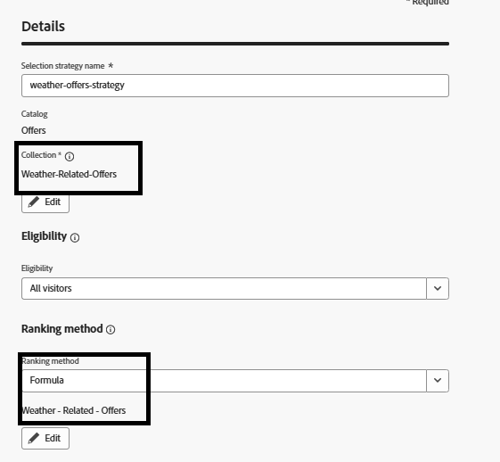

# 创建选择策略

选择策略是一种可重复使用的配置，它将优惠集合与资格规则以及排名方法结合使用，以确定在决策策略中使用策略时显示哪些优惠。

创建选择策略

* 登录到Journey Optimizer

* 导航到&#x200B;_**决策 — >策略设置 — >选择策略 — >创建选择策略**_

* 提供选择策略名称、收藏集、资格和排名方法，如屏幕快照中所示

确保使用公式作为排名方法

