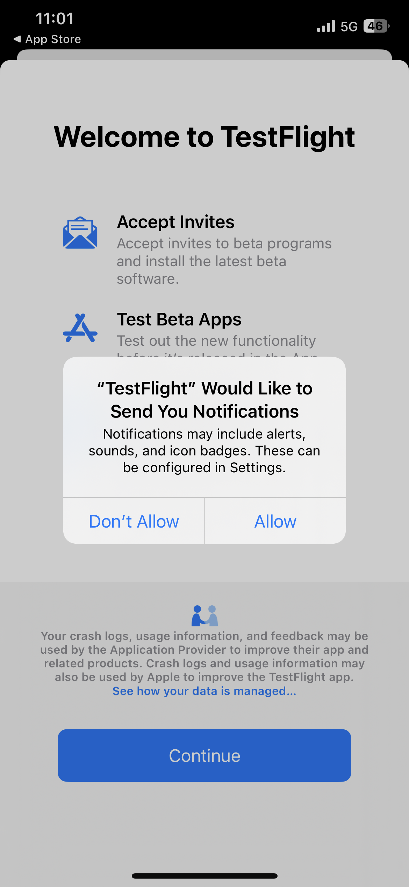

# Summit Lab L731- 备忘单

本页包含 L731 Summit Lab 中当前正在使用的文本和链接。您可以通过它将内容复制并粘贴到 Journey Optimizer 消息中。

## 练习 1.1 - 下载和安装应用程序

扫描 QR 代码以下载应用程序

>[!BEGINTABS]

>[!TAB iOS]

系统将要求您安装 Testflight，请参阅第 1 步至第 4 步。 安装 Testflight 后，请按照第 5 步至第 8 步的说明安装 Vegas Stay 应用程序：

<table>
<tr>
</tr>
<tr>
<td>
 

      

      <b>步骤 1 </b>
      

      
      

  </td>
  <td>
 

      

      <b>步骤 2 </b>
      

      
      

  </td>
  <td>
 

      

      <b>步骤 3 </b>
      

      
      

  </td>
  <td>
 

      

      <b>步骤 4 </b>
      

      
      

  </td>
  </tr>
  <tr>
<td>
 

      

      <b>步骤 5 </b>
      

      
      

  </td>
  <td>
 

      

      <a>
      <b>步骤 6 </b>
      

        
      </a>
      

  </td>
  <td>
 

      

      <a>
      <b>步骤 7 </b>
      

        
      </a>
      

  </td>
  <td>
 

      

      <a>
      <b>步骤 8 </b>
      

        
      </a>
      

  </td>
  </tr>
</table>

>[!TAB Android]

由于应用程序未在 Google Play 商店中注册，因此您将收到一条警告消息：

单击&#x200B;**仍要安装**

>[!ENDTABS]

## 练习 1：登录到 Adobe Journey Optimizer

[单击此处登录到 Journey Optimizer](https://experience.adobe.com/#/@techmarketingdemos/sname:summit-2023-ajo-lab/journey-optimizer/home)

**登录详细信息：**

* **用户名：**`L731+<your seat number>@summitlab.us`（示例：L731+001@summitlab.us）
* **密码：** Adobe2023!

## 练习 2 创建应用程序内营销活动

| 字段 | 文本 | 链接 |
|----|----|----|
| 营销活动名称 | `<your seat number> Vegas Stay Campaign` |  |
| 匹配项 | booknow |  |
| 媒体 URL 选项 |  | https://i.ibb.co/NstLhjW/Firefly-Poster-with-heading-Adobe-Max-84773.jpg |
| 标题 | 抢先买到优惠券！ |  |
| 正文 | Adobe·麦克斯回到拉斯维加斯。 准备迎接鼓舞人心的演讲、技能拓展课程和结识新朋友的机会。立即预订套房，现享10%优惠。 |  |
| 按钮 | 享受10%的折扣！ | lab://booking?suite=presidential&amp;discount=10 |
| 按钮：交互式事件 | 应用程序内 CTA |  |
| 基本 URL 用于在设备上预览 |  | **iOS：** lab://  **Android**： https://lab |

## 练习3：创建推送通知

| 字段 | 文本 | 链接 |
|----|----|----|
| 营销活动名称 | `<your seat number> Max Push Campaign` |  |
| 媒体 URL 选项 |  | https://i.ibb.co/NstLhjW/Firefly-Poster-with-heading-Adobe-Max-84773.jpg |
| 标题 | 嘿！ |  |
| 正文 | 你知道麦克斯Adobe要回拉斯维加斯吗。 现在预订房间，可享受10%的折扣。 |  |
