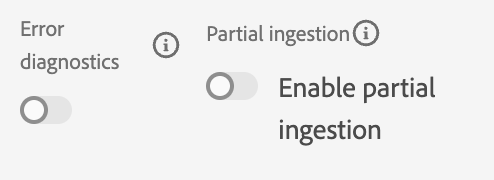

# 手动摄取数据

本节将指导您完成创建数据集和摄取示例数据所需的步骤。

>[!TIP]
>
> 观看视频教程 [创建数据集并摄取数据](/help/set-up-data/create-datasets-and-ingest-data.md) 开始之前。

您将创建5个 [!UICONTROL 数据集] 基于卢玛 [!UICONTROL 模式] 您在 [上一部分](/help/tutorial-configure-a-training-sandbox/manual-data-set-up.md). 创建数据集后，您可以从下载和修改的JSON文件中摄取数据。 (请参阅 [简介和先决条件](/help/tutorial-configure-a-training-sandbox/introduction-and-prerequisites.md) )。

## 创建第一个数据集

创建名为 *[!DNL Luma Loyalty Data]* 从 [!DNL Luma Loyalty schema]

1. 从左侧导航中，在 [!UICONTROL 数据管理]，选择 **[!UICONTROL 数据集]**.

1. 选择 **[!UICONTROL 创建数据集]**.

   

1. 在下一页，选择 [!UICONTROL 从架构创建数据集].

   

1. 在下一页，搜索 *[!DNL Luma Loyalty]* 您之前创建的架构。

1. 选择 *[!DNL Luma Loyalty]*。

1. 单击&#x200B;**[!UICONTROL 下一步]**。

   

1. 配置数据集：

   * 名称: `Luma Loyalty Data`

1. 单击&#x200B;**[!UICONTROL 完成]**。

   

## 摄取示例数据

创建数据集后，您可以将数据摄取到数据集中。

1. 在 [!DNL Luma Loyalty Data] 页面，向下滚动右侧面板的底部至 [!UICONTROL 添加数据] 部分和启用：

   * **[!UICONTROL 错误诊断]** 和

   * **[!UICONTROL 部分摄取]**

   

1. 拖放 `luma-loyalty.json` 文件将示例数据上传到数据集。

1. 刷新页面并检查批处理状态，以确认文件已正确摄取。

   375条记录应该被摄取。 摄取数据可能需要几分钟。

>[!TIP]
>
>如果批处理失败，请确保在 `luma-loyalty.json` 文件 [组织ID](https://experienceleague.adobe.com/docs/core-services/interface/administration/organizations.html?lang=zh-Hans).

## 另外创建五个 [!UICONTROL 数据集]

接下来，再创建以下五个 [!UICONTROL 数据集] 并将数据摄取到 `Luma CRM Data`, `Luma Products Data`和 `Luma Test Profiles` 数据集。

| 数据集名称 | 从模式 | 要摄取的文件 | 记录 |
| -----| ------ | -------| ------- |
| `Luma CRM Data` | `Luma CRM` | `luma-crm.json` | 500 |
| `Luma Products Data` | `Luma Products` | `luma-products.json` | 92 |
| `Luma Product Interactions Data` | `Luma Product Interactions` | 无 | 0 |
| `Luma Product Inventory Events` | `Luma Product Inventory Events` | 无 | 0 |
| `Luma Test Profiles` | `Luma Test Profiles` | `luma-test-profiles.json` | 3 |

## 后续步骤

您已成功创建所有必需的数据集并摄取示例数据。 最后一步是 [配置事件](/help/tutorial-configure-a-training-sandbox/configure-events.md).
