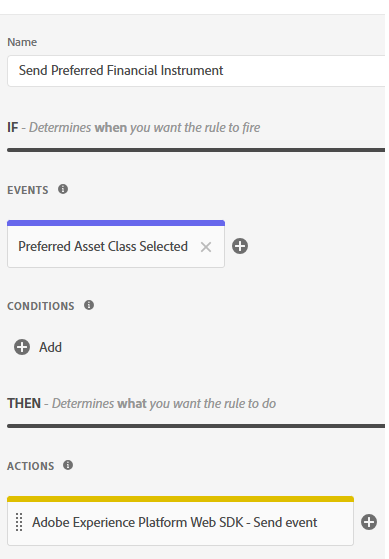

# 创建AEP标记

Adobe Experience Platform Tags(以前称为Adobe Launch)可帮助在您的网站上管理和部署*营销和分析技术，而无需更改网站的代码。

此[视频介绍了创建Adobe Experience Tags的过程](https://experienceleague.adobe.com/zh-hans/playlists/experience-platform-get-started-with-tags)

* 登录到数据收集
* 单击“标记” — >“新建属性”
* 创建一个名为“财务顾问”的Adobe Experience Platform标记。

* 将以下扩展添加到标记
  

* 确保将Adobe Experience Platform Web SDK配置为使用正确的环境以及在前一步骤中创建的Financial Advisors数据流。
  

* Adobe客户端数据层和核心扩展无需额外配置

## 创建数据元素

数据元素用于通过基于Web的营销和广告技术收集、组织和交付数据。

创建以下数据元素

| 元素名称 | 扩展 | 数据元素类型 | 其他注释 |
|------------------------------|-----------------------------------|-------------------|------------------------------------------------------------------------------------------------------------------------------------------------------------------|
| 首选金融工具 | 核心 | 自定义代码 | 请参阅下面的注释 |
| XDM 对象 | Adobe Experience Platform Web SDK | XDM对象 | 选择环境和财务顾问架构 |


对于自定义代码，打开代码编辑器并复制并粘贴以下代码

```javascript
return window.adobeDataLayer
  ?.slice()
  .reverse()
  .find(event => event.event === "assetClassSelection")
  ?.xdm?.FinancialInterest?.PreferredFinancialInstrument || "undefined";
```

## 代码说明

查看adobeDataLayer阵列（用于存储网页上发生的事件）。

使用.slice()制作数组的副本，这样原始数组就不会发生更改。

反转事件的顺序以首先检查最新事件。

查找event.event完全为“assetClassSelection”的第一个事件（从最新事件开始）。

如果找到，则进入该事件的xdm数据并从FinancialInterest.PreferredFinancialInstrument获取值。

如果未找到任何内容，则返回字符串“未定义”。


## 创建规则

通过Adobe Experience Platform标记中的规则生成器，您可以根据用户行为或事件定义特定操作在网站上运行的时间和方式。

* 创建名为“发送首选金融工具”的规则。 此规则包含一个事件和一个操作


* 创建名为选定的首选资源类的事件配置，如下所示。 此事件侦听assetClassSelection事件。
  


* 创建操作以将更新后的XDM架构发送到AEP
  

* 您的最终规则应如下所示
  

## 构建和部署AEP标记


创建一个新库并将所有已修改的资源添加到其中，如下面的屏幕截图所示。

添加库


创建库

在“创建库”屏幕中，指定库名称和环境。
您需要将所有已更改的资源添加到此库


然后单击Save and Build to Development按钮以生成库

## 在HTML页面中包含AEP标记

当您发布AEP Tags属性时，Adobe会为您提供一个必须放置在HTML ``` <head>```中或``` <body>```标记底部的脚本标记。

* 转到Tags(Financial Advisors)资产。

* 单击环境，然后单击所需环境的安装图标（例如，开发、暂存和生产）。

* 记下嵌入的代码。 在本教程的后期阶段需要使用该功能。
