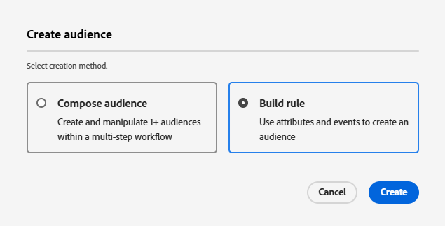
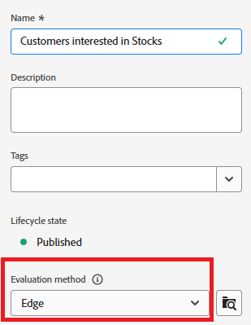
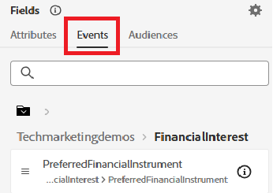
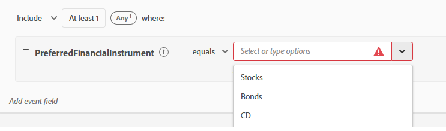
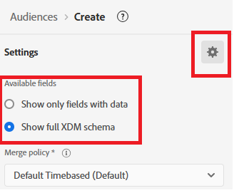

# 在Adobe Journey Optimizer中创建受众

Adobe Experience Platform中的受众是指根据用户的操作、偏好或配置文件信息创建的用户组，用于提供个性化体验。

* 登录到Journey Optimizer
* 导航到客户 — >受众 — >创建受众
* 使用构建规则方法创建受众

  

* 创建以下3个受众

   * 对股票感兴趣的客户

   * 对债券感兴趣的客户

   * 对CD感兴趣的客户

* 确保将每个受众的评估方法设置为&#x200B;_**Edge**_以进行实时资格鉴定。
  

* 使用PreferredFinancialInstrument字段根据用户选择的投资利息（如股票、债券或CD）划分用户

>[!NOTE]
>
>>如果PreferredFinancialInstrument字段在events选项卡中不可见，请单击设置图标并切换显示完整XDM架构。

