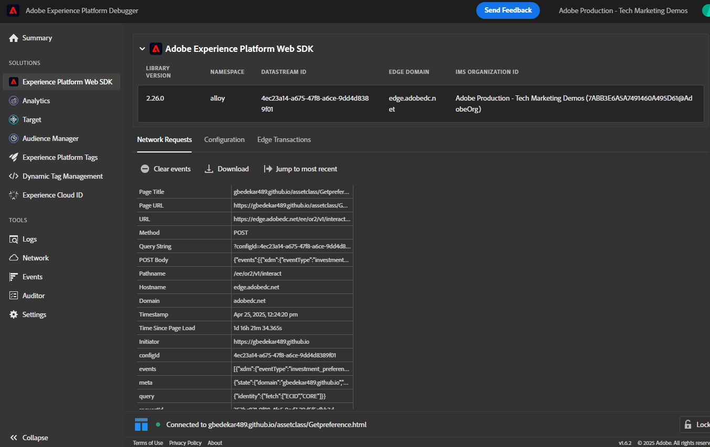

# 测试解决方案

要验证实施，请首先打开包含偏好设置表单的网页。 使用浏览器的DevTools（“控制台”和“网络”选项卡）监控表单提交过程。 提交偏好设置（例如，选择“库存”）后，请确认AEP Web SDK (alloy.sendEvent)已成功触发，并且已将正确数据发送到Adobe Experience Platform。 在AEP中，导航到“受众”部分，并使用Edge Segmentation验证您的配置文件在几分钟内是否符合预期受众的条件（例如，“感兴趣的股票”）。 您还可以检查关联数据集中的传入事件数据，以确保它包含正确的首选项值。 对每个资产类别（股票、债券、CD）重复此过程，以确保完整的工作流正常运行。

## 疑难解答提示

如果您没有看到配置文件立即符合目标受众的条件，请验证以下内容：

### 验证Adobe数据层推送

* 打开浏览器的开发人员工具→控制台
* 键入console.log(window.adobeDataLayer)；
* 确认提交表单后，显示事件为“assetClassSelection”的事件和正确的PreferredFinancialInstrument值

### 确认Launch规则执行

* 打开Adobe Experience Platform Debugger (Chrome扩展)
* 登录到调试器
* 提交表单
* 验证是否捕获了assetClassSelection的DataPushed事件

以下调试器屏幕截图应该可以帮助您

### 获取ECID

ECID (Experience Cloud ID)是Adobe的唯一永久标识符，用于在Experience Cloud解决方案和会话间识别和统一用户。

* Chrome Developer Tools → “网络”选项卡

* 按“交互”或“收集”筛选

* 提交表单
* 单击响应选项卡并记下ECID

### 检查实时用户档案和受众资格

* 登录到Journey Optimizer
* 转到“客户” — >“配置文件” — >“浏览”
* 搜索您在上一步得到的ECID，如屏幕快照中所示
  
* 单击配置文件并选择events选项卡以检查是否已列出investment_preference_event
  
* 打开与事件关联的json，并检查它是否包含正确的事件数据。

### 其他疑难解答提示

* 确保启用了架构和数据集配置文件。
* 确保为受众启用了Edge分段，以便近乎实时地进行鉴别。
* 等待几分钟并刷新受众视图也很有帮助，尤其是在发布更改后立即测试时。
* 确保正确定义受众规则，并引用从表单提交中捕获的精确字段名称和值。
