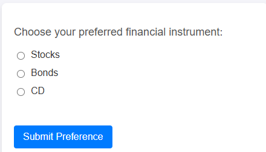

# 创建Web窗体

已创建以下HTML表单以捕获用户首选项


当用户单击网页上的按钮时，将会捕获他们选择的财务偏好设置（例如股票、债券或CD），并将其推送到Adobe Data Layer。 此事件(assetClassSelection)实时存储用户的选择。 然后，Adobe Launch侦听此事件，检索选定的投资选项(PreferredFinancialInstrument)，并可触发操作，如将数据发送到Adobe Experience Platform (AEP)或更新个性化规则

编写以下JavaScript以处理表单提交

```javascript
function handleSubmission() {
  window.adobeDataLayer = window.adobeDataLayer || [];

  const selectedAssetClass = document.querySelector('input[name="assetclass"]:checked');
  const errorMessage = document.getElementById("error-message");
  const messageBox = document.getElementById("message");

  if (!selectedAssetClass) {
    errorMessage.textContent = "Please select a financial instrument.";
    messageBox.textContent = "";
    return;
  }

  errorMessage.textContent = "";

  const subscriptionEvent = {
    event: "assetClassSelection",
    xdm: {
      eventType: "assetClassSelection",
      eventID: "investment_preference_event",
      timestamp: new Date().toISOString(),
      FinancialInterest: {
        PreferredFinancialInstrument: selectedAssetClass.value
      }
    }
  };

  console.log("📩 Sending asset class data to AEP:", subscriptionEvent);
  window.adobeDataLayer.push(subscriptionEvent);

  // ✅ Show thank-you message
  messageBox.textContent = `Thank you for selecting "${selectedAssetClass.value}". We'll use this to personalize your experience.`;
}
```

[示例HTML表单作为本教程的一部分提供](assets/webform.zip)
