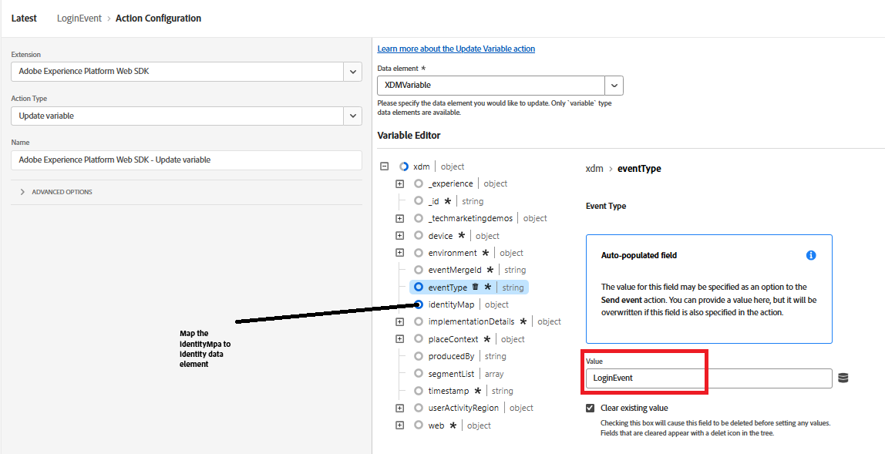

# 将CRMID发送到Adobe Experience Platform

Adobe Experience Platform Tags用于将CRMID发送到Adobe Experience Platform (AEP)，因为它为直接从浏览器传输身份数据提供了灵活的事件驱动机制。 在用户登录后发送CRMID可让AEP将匿名ECID与已知CRM配置文件关联，从而实现准确的身份拼接。 这种关联构成了在Adobe Journey Optimizer (AJO)中构建统一客户档案、确定受众资格和提供实时个性化体验的基础。

已创建名为&#x200B;_**FinWise**_&#x200B;的Experience Platform Tags属性。 已将以下扩展添加到Tags属性

使用在上一步创建的Financial Advisors DataStream配置AEP Web SDK扩展。
Experience Cloud ID服务是一个可选扩展，已添加到标记属性中以用于调试。

## 标记数据元素

创建以下数据元素

| 数据元素 | 扩展 | 数据元素类型 | 自定义设置 |
|--------------|-----------------------------------|---------------------------|----------------------------------------|
| crmid | Adobe客户端数据层 | 数据层计算状态 | user.crmid |
| ECID | Experience Cloud ID 服务 | ECID |                                        |
| 身份标识 | Adobe Experience Platform Web SDK | 标识映射 |  |
| XDMVariable | Adobe Experience Platform Web SDK | Variable |  |

## 创建规则

使用以下事件和操作创建一个名为LoginEvent的规则

事件

更新变量操作

发送事件操作

## 保存并构建

保存更改，创建并构建库。
