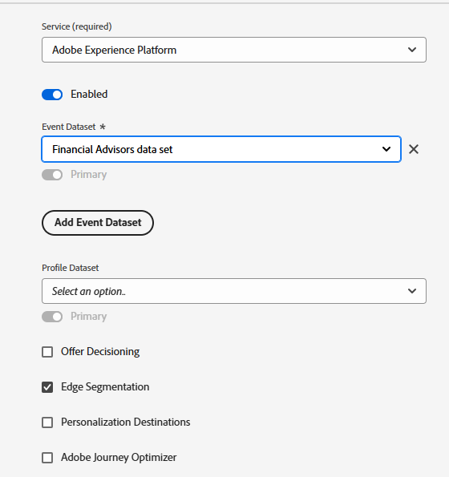

# 在AEP中设置XDM架构、数据集和数据流

## 创建XDM架构

要在网页上使用Adobe Experience Platform Web SDK (Alloy.js)，AEP Tags必须与映射到XDM事件架构的数据流关联。 Web SDK (alloy.sendEvent)将数据作为Experience Event发送到AEP，后者必须符合XDM架构（基于XDM ExperienceEvent类）。

创建XDM架构

* 登录到Adobe Experience Platform
* 数据管理 — >架构 — >创建架构

* 创建名为&#x200B;**_财务顾问_**&#x200B;的基于XDM事件的架构。 如果您不熟悉如何创建架构，请按照此[文档](https://experienceleague.adobe.com/zh-hans/docs/experience-platform/xdm/tutorials/create-schema-ui)进行操作

* 确保为配置文件启用架构。

## 根据架构创建数据集

Adobe Experience Platform (AEP)**中的**&#x200B;数据集是一个结构化存储容器，用于根据定义的XDM架构摄取、存储和激活数据。

* 数据管理 — >数据集 — >创建数据集
* 根据上一步创建的XDM架构（财务顾问）创建一个名为&#x200B;**_财务顾问数据集_**&#x200B;的数据集。

* 确保为配置文件启用数据集

## 创建数据流

Adobe Experience Platform中的数据流就像一条安全管道（或高速公路），它将您的网站或应用程序连接到Adobe服务，允许数据传入并返回个性化内容。

* 导航到数据收集>数据流，然后单击新建数据流。 命名数据流&#x200B;**_财务顾问数据流_**

* 提供以下详细信息，如下面的屏幕快照所示
  
* 单击保存，然后单击添加映射并添加Adobe Experience Platform服务和事件数据集，如下所示
  

* 选择相应的事件数据集（之前创建）。

* 保存数据流。
