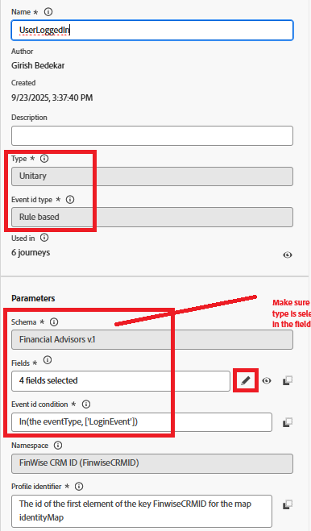

# 使用Adobe Journey Optimizer Web SDK触发Adobe历程

在身份拼接教程的这个扩展中，会触发Adobe Journey Optimizer历程，从而使用登录用户拼接的配置文件向其发送电子邮件。 **本文假定您熟悉电子邮件渠道并为电子邮件渠道创建内容。**

## 创建电子邮件渠道配置

* 登录到&#x200B;_**Journey Optimizer**_
* 导航到&#x200B;_**管理 — >渠道 — >创建渠道配置**_
* 从渠道列表中选择&#x200B;**电子邮件**。 提供有意义的名称和描述。
* 填写电子邮件设置。
* 提供如下所示的执行详细信息。 电子邮件将发送到存储在字段中的用户档案的电子邮件地址
* 
* 激活电子邮件渠道配置

## 创建事件

* 登录到&#x200B;_**Journey Optimizer**_
* 导航到&#x200B;_**管理 — >配置**_
* 单击事件信息卡的管理按钮，然后单击创建事件。 指定如下所示的值
* 

* 检查事件的eventType是否等于LoginEvent。 `LoginEvent`类型是在Adobe Experience Platform标记中设置的。
* 保存事件

## 创建历程

* 登录到&#x200B;_**Journey Optimizer**_
* 导航到&#x200B;_**历程管理 — >历程->创建历程**_
* 将&#x200B;_**UserLoggedIn**_&#x200B;事件拖放到画布上
* 从操作菜单中拖放电子邮件。 配置电子邮件操作以使用之前创建的电子邮件渠道配置。
* 发布历程。

## 历程的触发方式

当通过Web SDK发送的事件有效负载与旅程中配置的匹配时，将触发旅程。 在此示例中，事件是`UserLoggedIn`，事件类型是`LoginEvent`。

* 通过查看历程报告验证此设置
* 
