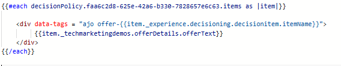

# 创建营销活动

为了向网页上的用户提供个性化优惠，在Adobe Journey Optimizer中创建了一个营销活动，并配置了正确的渠道 — Web渠道。 此配置可确保通过实时决策将优惠提供给与网站交互的用户。

在此营销活动中，定义了一个决策策略来控制优惠的选择方式。 决策策略包括选择策略，该选择策略包括：

优惠项目的集合（例如，基于邮政编码或收入），

确定哪些选件适用于用户的资格规则，以及

一种排名公式，用于将分数分配给符合条件的优惠，以优先处理最相关的优惠。

当登录用户访问网站时，会向AJO发送个性化请求。 决策策略会根据用户的拼接身份和配置文件属性（如邮政编码和年收入），评估所有可用优惠。 它应用选择策略和排名逻辑来确定最佳匹配。

结果是一组定制的选件，作为HTML内容返回，并在网站上的轮播中向用户显示，从而创造一种无缝、实时的个性化体验。

## 在AJO中创建营销活动的高级步骤

1. **创建渠道配置**\
   定义选件的显示位置及方式（例如，具有基于代码的体验的网页）。
   - **名称**： `finwise-web-personalization`\
     标识此配置以用于FinWise的个性化Web选件交付。

   - **平台**： `Web`\
     专门针对Web浏览器进行定位。 未启用任何移动渠道。

   - **体验类型**： `Code-based experience`\
     选件不会直接插入到DOM中。 相反，AJO会返回使用自定义JavaScript解析的原始HTML。

   - **页面URL**： `http://localhost:3000/formula.html`\
     该渠道针对开发期间使用的特定测试页面进行配置。

   - **在页面**&#x200B;上的位置： `offers-div`\
     返回的选件会使用前端逻辑动态解析并呈现到此容器中。

   - **内容格式**： `HTML`\
     选件作为原始HTML片段交付，允许完全控制其样式、过滤和显示方式。

2. **开始新的营销活动**\
   导航到营销活动部分，然后使用Web渠道创建新营销活动。

3. **添加操作**\
   添加基于代码的体验操作，并将该操作链接到之前创建的渠道配置。

4. **受众**\
   所有访客（默认）。

   身份类型：ECID (Experience Cloud ID)
此设置使用ECID作为识别用户的主要标识。 当进行身份拼接时，ECID会链接到Personalized Targeting的CRM ID。选择或创建用于定义优惠逻辑的决策策略。

5. **决策策略**

   该操作已链接到&#x200B;**决策策略**，该策略定义如何选择优惠以及返回多少优惠以供显示。 此策略使用本教程前面创建的&#x200B;**选择策略**。

   选择策略是&#x200B;**基于公式**，这意味着它使用排名公式为符合条件的优惠分配得分，并确定哪些优惠应优先处理。

   该战略包括：

   - **优惠收藏集**\
     与促销活动相关的预定义优惠集，例如特定于邮政编码或基于收入的优惠。

   - **资格规则**\
     资格设置为&#x200B;**_所有访客_**

   - **排名公式**\
     用于对每个合格选件进行评分的逻辑表达式。 得分最高的选件在个性化体验中呈现。

6. **插入决策策略**

   

   Handlebars代码循环执行Adobe Journey Optimizer中特定决策策略返回的优惠，并为每个优惠创建`
`。 每个`
`都使用带有优惠内部名称的data-tags属性来帮助轮播组并按类别组织优惠，以便顺利导航。 每个`
`中的内容都显示了个性化优惠文本，支持以动态和可视方式分段显示多个优惠。

7. **发布营销活动**\
   激活营销活动以开始实时提供个性化优惠。

