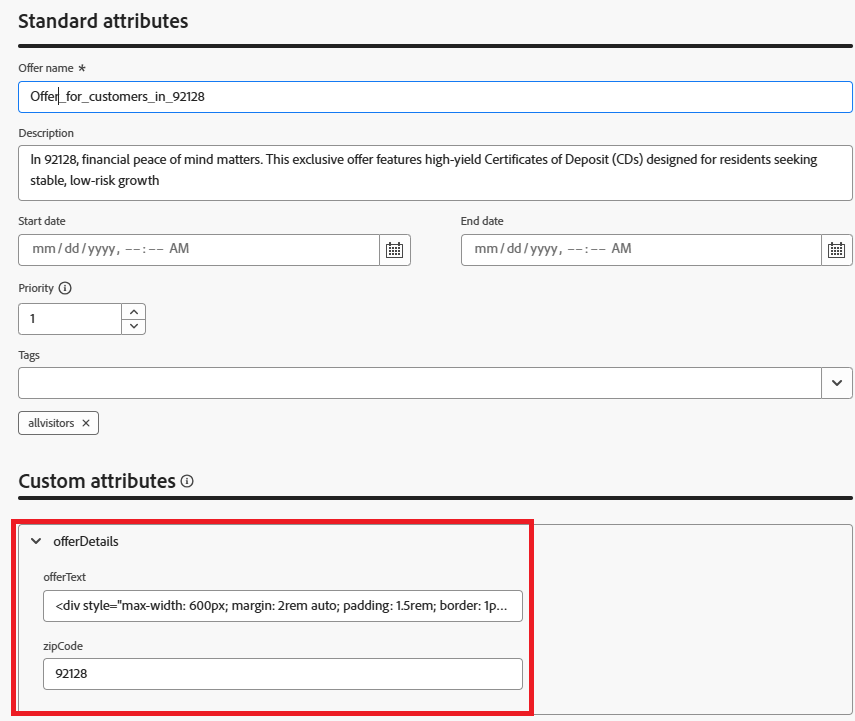

# 使用邮政编码定位创建基于位置的选件

在创建选件之前，已对选件项目架构进行了扩展，以包含一个新字段：zipCode 。 通过此自定义字段，可使用每个选件的目标邮政编码明确标记该选件，从而在决策期间实现基于位置的过滤和排名。

更新了架构后，创建了两个个性化优惠：

* 报价1：“Mira Mesa (92126)的灵活投资计划”
该优惠专为92126国年轻专业人士和以科技为重点的居民量身打造，旨在促进灵活的投资选择，例如ETF和共同基金，旨在实现长期增长。 邮政编码字段设置为92126。

* 选件2： “兰乔·贝尔纳多的高产CD (92128)”
92128年以经济上稳定、退休后准备就绪的个人为目标，提供有保证回报的高收益存款证(CD)。 邮政编码字段设置为92128。

这些选件现在包含位置元数据，因此可在后续步骤中根据用户个人资料邮政编码进行动态选择和排名。

以下屏幕截图显示了添加到选件项目架构的自定义属性。




## 适用于92126的选件

以邮政编码表示的优惠92126选件文本

```html
<div style="max-width: 600px; margin: 2rem auto; padding: 1.5rem; border: 1px solid #ddd; border-radius: 12px; font-family: Arial, sans-serif; background-color: #f9f9f9; box-shadow: 0 4px 12px rgba(0,0,0,0.05);">   <h2 style="color: #1a237e; font-size: 1.5rem; margin-bottom: 0.5rem;">     Boost Your Financial Game with Smart Investment Options   </h2>   <p style="color: #333; font-size: 1rem; line-height: 1.6;">     In Mira Mesa (92126), ambition meets opportunity. Whether you're building wealth or just getting started, our     <strong>diversified investment plans</strong> — including <strong>tech-focused ETFs</strong> and     <strong>flexible mutual funds</strong> — are designed to grow with your goals.   </p>   <p style="color: #333; font-size: 1rem; line-height: 1.6;">     Enjoy expert guidance, low fees, and strategies built for busy professionals who want more from their money — without the hassle.   </p>   <a href="#start-investing" style="display: inline-block; margin-top: 1rem; background-color: #1a73e8; color: white; padding: 0.75rem 1.25rem; border-radius: 8px; text-decoration: none; font-weight: bold;">     Start Investing Smarter   </a> </div>
```


## 适用于92128的选件

以邮政编码表示的优惠92128选件文本

```html
<div style="max-width: 600px; margin: 2rem auto; padding: 1.5rem; border: 1px solid #ddd; border-radius: 12px; font-family: Arial, sans-serif; background-color: #fdfdfd; box-shadow: 0 4px 12px rgba(0,0,0,0.05);">   <h2 style="color: #1a237e; font-size: 1.5rem; margin-bottom: 0.5rem;">     Grow Your Savings with Confidence – Exclusive CD Rates for 92128   </h2>   <p style="color: #333; font-size: 1rem; line-height: 1.6;">     Live in Rancho Bernardo? Take advantage of your financial momentum with our <strong>high-yield Certificates of Deposit</strong>, offering up to <strong>5.25% APY</strong>.     Designed for peace of mind and smart growth, our flexible CD options let you lock in guaranteed returns while enjoying the stability you deserve.   </p>   <p style="color: #333; font-size: 1rem; line-height: 1.6;">     Whether you're planning retirement or simply securing your future, this offer is tailored for residents like you.   </p>   <a href="#explore-cd-options" style="display: inline-block; margin-top: 1rem; background-color: #1a73e8; color: white; padding: 0.75rem 1.25rem; border-radius: 8px; text-decoration: none; font-weight: bold;">     Explore CD Options   </a> </div>
```

## 通用选件（后备选件）

通用选件的选件文本，不含与选件关联的任何邮政编码

```html
<div style="max-width: 600px; margin: 2rem auto; padding: 1.5rem; border: 1px solid #ddd; border-radius: 12px; font-family: Arial, sans-serif; background-color: #ffffff; box-shadow: 0 4px 12px rgba(0,0,0,0.05);">
  <h2 style="color: #1a237e; font-size: 1.5rem; margin-bottom: 0.5rem;">
    Invest Smarter: Build Wealth with Flexible Financial Plans
  </h2>
  <p style="color: #333; font-size: 1rem; line-height: 1.6;">
    Looking to take control of your financial future? Our flexible investment solutions are designed to meet a wide range of goals — from growing savings to planning for retirement.
    Choose from diversified mutual funds, ETFs, and professionally managed portfolios, all with expert guidance and minimal hassle.
  </p>
  <p style="color: #333; font-size: 1rem; line-height: 1.6;">
    Whether just starting out or optimizing an existing strategy, this offer provides the tools to invest with confidence — no matter where you live.
  </p>
  <a href="#explore-investment-plans" style="display: inline-block; margin-top: 1rem; background-color: #1a73e8; color: white; padding: 0.75rem 1.25rem; border-radius: 8px; text-decoration: none; font-weight: bold;">
    Explore Investment Plans
  </a>
</div>
```

将这些优惠分组到一个名为&#x200B;**_GenericOffers_**&#x200B;的集合中

选件适用于所有访客（这意味着没有严格的资格限制），则排名公式对于根据用户档案上下文确定应显示哪个选件至关重要。
由于资格规则不筛选选件，因此这三者都被视为候选人。
选择策略将检索全部三个。
排名公式会根据用户档案属性（如邮政编码和annualIncome）对他们进行评分，以选出最佳用户档案。


