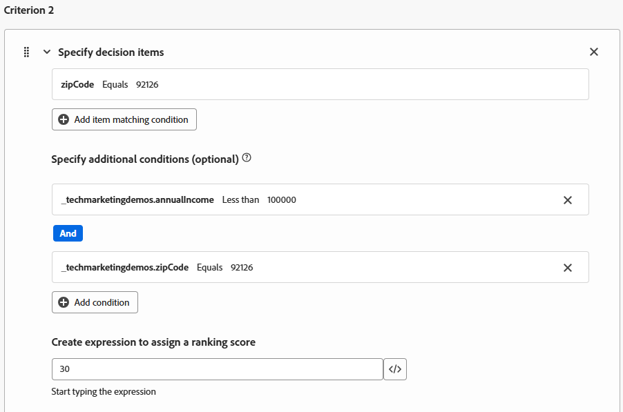

# 创建排名公式

Adobe Journey Optimizer中的排名公式在Offer Decisioning过程中使用，尤其是在选择策略中，用于确定符合条件的优惠的优先级顺序。 资格筛选后，当多个选件符合给定用户档案的条件，但根据业务逻辑或用户档案上下文，只能呈现前一个（或少数个）时，排名公式就会起作用。

* 登录到Journey Optimizer

* 决策 — >策略设置 — >排名公式 — >创建公式

排名公式

排名公式中的标准是指用于将分数分配给优惠的条件规则。 这些标准将比较选件和用户档案或上下文中的属性，以确定选件与特定个人的相关性。

标准1

标准1包含三个标准：

* 选件。_techmarketingdemos.offerDetails.zipCode == &quot;92128&quot; — 检查与选件关联的邮政编码。

* _techmarketingdemos.zipCode == &quot;92128&quot; — 检查用户配置文件上的邮政编码。

* _techmarketingdemos.annualIncome > 100000 — 检查用户个人资料中的收入级别。

如果满足所有这些标准，选件将获得40分。

标准2

标准2包含三个标准：

* 选件。_techmarketingdemos.offerDetails.zipCode == &quot;92126&quot; — 检查与选件关联的邮政编码。

* _techmarketingdemos.zipCode == &quot;92126&quot; — 检查用户配置文件上的邮政编码。

* _techmarketingdemos.annualIncome &lt; 100000 — 检查用户个人资料中的收入级别。

如果满足所有这些标准，选件将获得30分。

