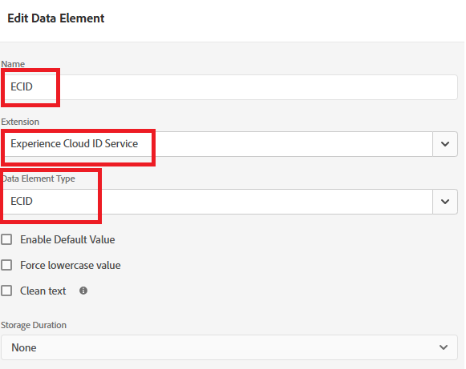

# 创建Adobe Experience Platform标签

在网页上配置Experience Platform标记以加载Adobe Experience Platform Web SDK，从而启用sendEvent API调用以触发个性化体验。 此设置可确保正确初始化必要的客户端库，从而允许与Adobe Journey Optimizer实时交互以提供选件。

1. 登录到数据收集。
1. 单击&#x200B;**[!UICONTROL 标记]** > **[!UICONTROL 新建属性]**。
1. 创建一个名为“ECID服务”的Adobe Experience Platform标记。
1. 将以下扩展添加到标记中：

   

1. 配置Adobe Experience Platform Web SDK以使用正确的环境以及在上一教程中创建的Financial Advisors数据流

   

Adobe客户端数据层和核心扩展无需额外配置

## 创建数据元素

Experience Platform标记中的ECID数据元素仅用于调试和测试目的。 数据元素允许开发人员查看分配给用户浏览器会话的Experience Cloud ID，这有助于验证身份拼接并确保`sendEvent`调用与正确的配置文件关联。 此元素不是个性化正常工作所必需的，但在实施和QA期间非常有用

## 在HTML页面中包含AEP标记

构建和发布Adobe Experience Platform标记。

发布AEP Tags属性时，Adobe会为您提供一个必须放置在HTML `<head>`中或`<body>`标记底部的脚本标记。

1. 转到标记（ECID服务）资产。

1. 单击环境，然后单击所需环境的安装图标（例如，开发、暂存和生产）。

1. 记下嵌入的代码。

   此代码需要放置在HTML页面中的结束`</body>`标记之前。
