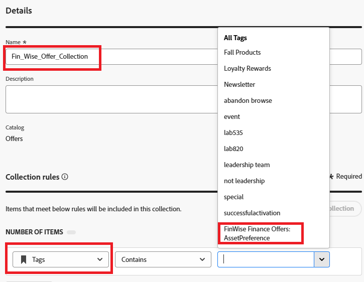

# 创建收藏集

您可以使用收藏集根据自己的喜好对决策项进行分类和分组。 通过制定利用决策项属性的规则而创建这些类别。

1. 登录Journey Optimizer。
1. 单击&#x200B;**[!UICONTROL 决策]** > **[!UICONTROL 目录]** > **[!UICONTROL 集合]** > **[!UICONTROL 创建集合]**。
1. 指定收藏集名称和收藏集规则，如下面的屏幕快照所示。

   
