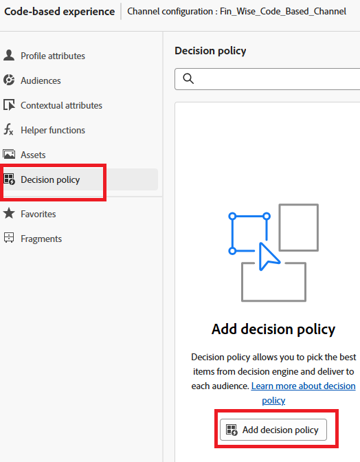

# 创建决策策略

决策策略是优惠的容器，这些优惠利用[!UICONTROL 决策]引擎，以便根据受众来选择应投放的最佳内容。

1. 在个性化编辑器中，单击左侧导航中的&#x200B;**[!UICONTROL 决策策略]**&#x200B;项，然后单击&#x200B;**[!UICONTROL 添加决策策略]**。

   

1. 单击&#x200B;**[!UICONTROL 添加]**&#x200B;以选择选择策略。

   

1. 单击&#x200B;**[!UICONTROL 选择后备]**&#x200B;以选择后备优惠。
1. 单击&#x200B;**[!UICONTROL 下一步]**&#x200B;以查看决策策略。
1. 单击&#x200B;**[!UICONTROL 创建]**&#x200B;以完成创建决策策略的过程。

## 在代码编辑器中使用决策策略

1. 在个性化编辑器中，单击&#x200B;**[!UICONTROL 插入策略]**。

   将添加与决策策略对应的代码。

   在此阶段，您可以直接在代码中包含任何所需的决策属性。 这些属性在选件目录使用的架构中定义。 标准属性在`__experience`命名空间下组织，而特定于您的组织的任何自定义属性都存储在`_<imsOrg>`命名空间下。

   

   此代码会浏览为用户选择的个性化优惠列表，并在网页上显示每个优惠的文本。 它显示段落中每个选件的消息（称为`offerText`），以便用户清楚地看到他们定制的内容。

   如果没有可用的个性化优惠，则会显示后备优惠，以确保空间不会留空。

1. 单击&#x200B;**[!UICONTROL 保存]**，然后激活该营销活动。
