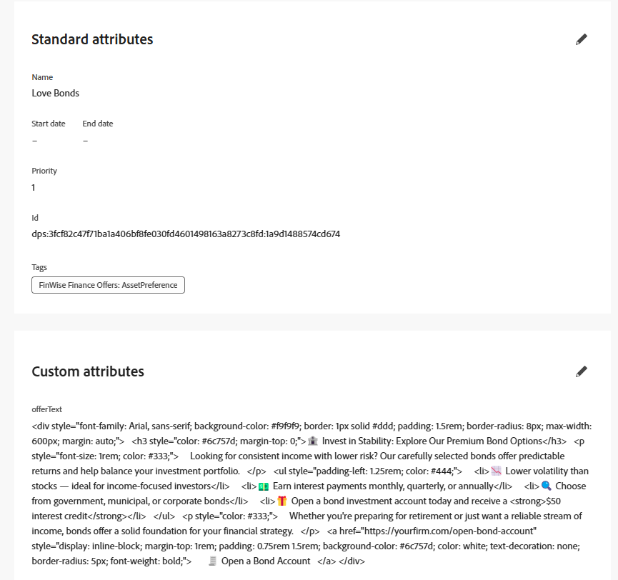

# 创建产品建议

AJO中的优惠项表示一段个性化内容。 内容可以是交付给用户的促销活动、消息或推荐（基于决策逻辑）。

在AJO中创建选件项时，必须基于[!UICONTROL 决策架构]。 此架构定义选件中可用的结构和字段，例如标题、描述、图像URL、选件文本等。

此架构：

* 标准化收藏集中所有选件的内容模型。

* 允许跨优惠项目使用一致的个性化字段。

* 启用选择策略以将规则与结构化内容匹配

## 修改架构

1. 登录到Journey Optimizer。
1. 单击&#x200B;**[!UICONTROL 决策]** > **[!UICONTROL 目录]** > **[!UICONTROL 编辑架构]**。
1. 添加名为`offerItem`的`string`类型的元素，如下所示

   

## 创建优惠项目

1. 单击&#x200B;**[!UICONTROL 决策]** > **[!UICONTROL 目录]** > **[!UICONTROL 创建项目]**。

1. 创建三个选件： `Love Stocks`、`Love Bonds`和`Love CD`。

   对于每个选件，将本文末尾提供的相应选件文本复制并粘贴到相应的选件项目中。

1. 使用在上一步中创建的标记来标记选件。

1. 批准选件。

定义了标准和自定义属性的已完成选件：



**热门股票选件文本**

```html
<div style="font-family: Arial, sans-serif; background-color: #f9f9f9; border: 1px solid #ddd; padding: 1.5rem; border-radius: 8px; max-width: 600px; margin: auto;">   <h3 style="color: #1a73e8; margin-top: 0;">📈 Open a Stock Trading Account & Get $100 in Bonus Stock</h3>   <p style="font-size: 1rem; color: #333;">     Ready to start building your portfolio? Open a new stock trading account with us and receive a      <strong>$100 bonus in stock</strong> — on us.   </p>   <ul style="padding-left: 1.25rem; color: #444;">     <li>🧾 No account minimums — start investing with as little as $1</li>     <li>📉 $0 commissions on online stock trades</li>     <li>📊 Access to powerful trading tools and real-time analytics</li>     <li>🎓 Free educational resources to help you invest confidently</li>   </ul>   <p style="color: #333;">     It's never been easier to start trading. Join thousands of investors who trust us to help them grow their wealth.   </p>   <a href="https://yourbrokerage.com/open-account"      style="display: inline-block; margin-top: 1rem; padding: 0.75rem 1.5rem; background-color: #1a73e8; color: white; text-decoration: none; border-radius: 5px; font-weight: bold;">      🚀 Open Your Account Today   </a> </div>
```

**爱情债券优惠文本**

```html
<div style="font-family: Arial, sans-serif; background-color: #f9f9f9; border: 1px solid #ddd; padding: 1.5rem; border-radius: 8px; max-width: 600px; margin: auto;">   <h3 style="color: #6c757d; margin-top: 0;">🏦 Invest in Stability: Explore Our Premium Bond Options</h3>   <p style="font-size: 1rem; color: #333;">     Looking for consistent income with lower risk? Our carefully selected bonds offer predictable returns and help balance your investment portfolio.   </p>   <ul style="padding-left: 1.25rem; color: #444;">     <li>📉 Lower volatility than stocks — ideal for income-focused investors</li>     <li>💵 Earn interest payments monthly, quarterly, or annually</li>     <li>🔍 Choose from government, municipal, or corporate bonds</li>     <li>🎁 Open a bond investment account today and receive a <strong>$50 interest credit</strong></li>   </ul>   <p style="color: #333;">     Whether you're preparing for retirement or just want a reliable stream of income, bonds offer a solid foundation for your financial strategy.   </p>   <a href="https://yourfirm.com/open-bond-account"      style="display: inline-block; margin-top: 1rem; padding: 0.75rem 1.5rem; background-color: #6c757d; color: white; text-decoration: none; border-radius: 5px; font-weight: bold;">      🧾 Open a Bond Account   </a> </div>
```

**喜欢CD选件文本**

```html
<div style="font-family: Arial, sans-serif; background-color: #f9f9f9; border: 1px solid #ddd; padding: 1.5rem; border-radius: 8px; max-width: 600px; margin: auto;">   <h3 style="color: #28a745; margin-top: 0;">💰 Lock in a 5.25% APY — Open Your CD Account Today</h3>   <p style="font-size: 1rem; color: #333;">     Secure your savings with a high-yield Certificate of Deposit. For a limited time, enjoy a      <strong>guaranteed 5.25% annual percentage yield (APY)</strong> on 12-month CDs.   </p>   <ul style="padding-left: 1.25rem; color: #444;">     <li>🔒 Guaranteed returns with FDIC insurance</li>     <li>📈 Lock in today's high rates before they change</li>     <li>💼 Flexible terms from 6 to 24 months</li>     <li>🎁 Open with just $500 and get a $50 bonus</li>   </ul>   <p style="color: #333;">     Whether you're saving for a short-term goal or building a conservative income strategy, our CDs offer peace of mind and predictable growth.   </p>   <a href="https://yourbank.com/open-cd"      style="display: inline-block; margin-top: 1rem; padding: 0.75rem 1.5rem; background-color: #28a745; color: white; text-decoration: none; border-radius: 5px; font-weight: bold;">      💼 Open a CD Account   </a> </div>
```
